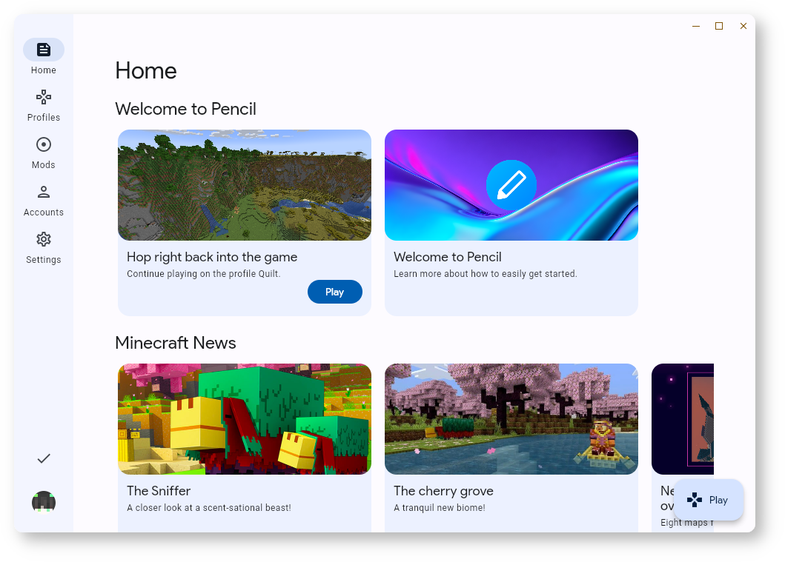

# Pencil

Pencil is an in-development Material Design Minecraft launcher based on Flutter.

## Current Features
* [x] Material Design looks really good
* [x] Microsoft authentication
* [x] Isolated profiles
* [x] Launches the vanilla, Fabric and Quilt client (Forge support in progress)
* [ ] Mod management

## Screenshots




## Development

Pencil is built against the stable version of Flutter, and can be built on Linux, Windows and macOS. To get started,
clone the directory and download the required fonts in `fonts/`. After that, you can run:

```
flutter pub get
flutter build <system>
```

## License

```
Pencil is a Material Design Minecraft launcher.
Copyright (C) 2023 Dreta

This program is free software: you can redistribute it and/or modify
it under the terms of the GNU General Public License as published by
the Free Software Foundation, either version 3 of the License, or
(at your option) any later version.

This program is distributed in the hope that it will be useful,
but WITHOUT ANY WARRANTY; without even the implied warranty of
MERCHANTABILITY or FITNESS FOR A PARTICULAR PURPOSE.  See the
GNU General Public License for more details.

You should have received a copy of the GNU General Public License
along with this program.  If not, see <https://www.gnu.org/licenses/>.
```
